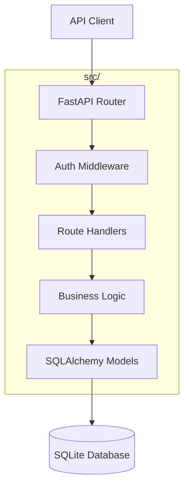

# Example Discovery Output

This is an example output from the Discovery prompt for a Task Management API.

---

# Architecture - Task Management API

## Project Scope

**In Scope:**
- RESTful API for task CRUD operations
- User authentication with JWT tokens
- SQLite database for data persistence
- Input validation and error handling

**Out of Scope:**
- Frontend/UI application
- Real-time notifications (WebSockets)
- Multi-tenancy / organizations
- File attachments on tasks

**Target Users:**
- Developers building task management frontends
- Teams needing a simple task API backend

**Success Criteria:**
- User can register, login, and manage their tasks
- API returns proper HTTP status codes and error messages
- All endpoints are documented
- Test coverage > 80%

## Architecture Overview



**Technology Stack:**
| Technology | Version | Rationale |
|------------|---------|-----------|
| Python | 3.10+ | Modern features, type hints |
| FastAPI | 0.100+ | Async, automatic OpenAPI |
| SQLAlchemy | 2.0+ | ORM with async support |
| SQLite | 3 | Simple, no server needed |
| Pydantic | 2.0+ | Validation, serialization |
| PyJWT | 2.8+ | JWT token handling |
| pytest | 7.0+ | Testing framework |

## Module Breakdown

| Module | Purpose | Public API | Dependencies | Location |
|--------|---------|------------|--------------|----------|
| models | Database models | User, Task, Base | - | src/models/ |
| auth | Authentication | create_token, verify_token, get_current_user | models | src/auth/ |
| services | Business logic | TaskService, UserService | models, auth | src/services/ |
| routes | API endpoints | router | services, auth | src/routes/ |
| schemas | Pydantic models | UserCreate, TaskCreate, etc. | - | src/schemas/ |

### models Module

```python
# src/models/base.py
class Base:
    """SQLAlchemy declarative base"""

# src/models/user.py
class User(Base):
    id: int
    email: str
    hashed_password: str
    created_at: datetime
    tasks: List[Task]

# src/models/task.py
class Task(Base):
    id: int
    title: str
    description: str | None
    status: str  # pending, in_progress, completed
    user_id: int
    created_at: datetime
    updated_at: datetime
```

### auth Module

```python
# src/auth/jwt.py
def create_token(user_id: int) -> str: ...
def verify_token(token: str) -> dict: ...

# src/auth/dependencies.py
async def get_current_user(token: str) -> User: ...
```

### services Module

```python
# src/services/user_service.py
class UserService:
    async def create(email: str, password: str) -> User: ...
    async def authenticate(email: str, password: str) -> User | None: ...
    async def get_by_id(user_id: int) -> User | None: ...

# src/services/task_service.py
class TaskService:
    async def create(user_id: int, data: TaskCreate) -> Task: ...
    async def list(user_id: int) -> List[Task]: ...
    async def get(task_id: int, user_id: int) -> Task | None: ...
    async def update(task_id: int, user_id: int, data: TaskUpdate) -> Task: ...
    async def delete(task_id: int, user_id: int) -> bool: ...
```

## Data Models

```python
# Pydantic schemas for API
class UserCreate(BaseModel):
    email: EmailStr
    password: str  # min 8 chars

class UserResponse(BaseModel):
    id: int
    email: str
    created_at: datetime

class TaskCreate(BaseModel):
    title: str  # max 200 chars
    description: str | None = None

class TaskUpdate(BaseModel):
    title: str | None = None
    description: str | None = None
    status: Literal["pending", "in_progress", "completed"] | None = None

class TaskResponse(BaseModel):
    id: int
    title: str
    description: str | None
    status: str
    created_at: datetime
    updated_at: datetime
```

## External Dependencies

| Dependency | Version | Purpose |
|------------|---------|---------|
| fastapi | ^0.100.0 | Web framework |
| uvicorn | ^0.23.0 | ASGI server |
| sqlalchemy | ^2.0.0 | Database ORM |
| pydantic | ^2.0.0 | Validation |
| pyjwt | ^2.8.0 | JWT tokens |
| passlib | ^1.7.4 | Password hashing |
| pytest | ^7.0.0 | Testing |
| httpx | ^0.24.0 | Test client |

## MVP Definition

Minimum viable product criteria:

- [x] User can register with email/password
- [ ] User can login and receive JWT token
- [ ] User can create a task
- [ ] User can list their tasks
- [ ] User can update task status
- [ ] User can delete a task
- [ ] API returns 401 for unauthenticated requests
- [ ] API returns 404 for non-existent resources
- [ ] API returns 422 for validation errors

**Deferred to future versions:**
- Password reset flow
- Task filtering and search
- Pagination
- Task due dates
- Task priorities

## Risks and Unknowns

| Risk | Impact | Mitigation |
|------|--------|------------|
| SQLite concurrency limits | Medium | Document limitation, easy to swap to PostgreSQL |
| JWT token revocation | Low | Short expiry times, stateless is acceptable for MVP |
| No rate limiting | Medium | Add in future iteration before production |
